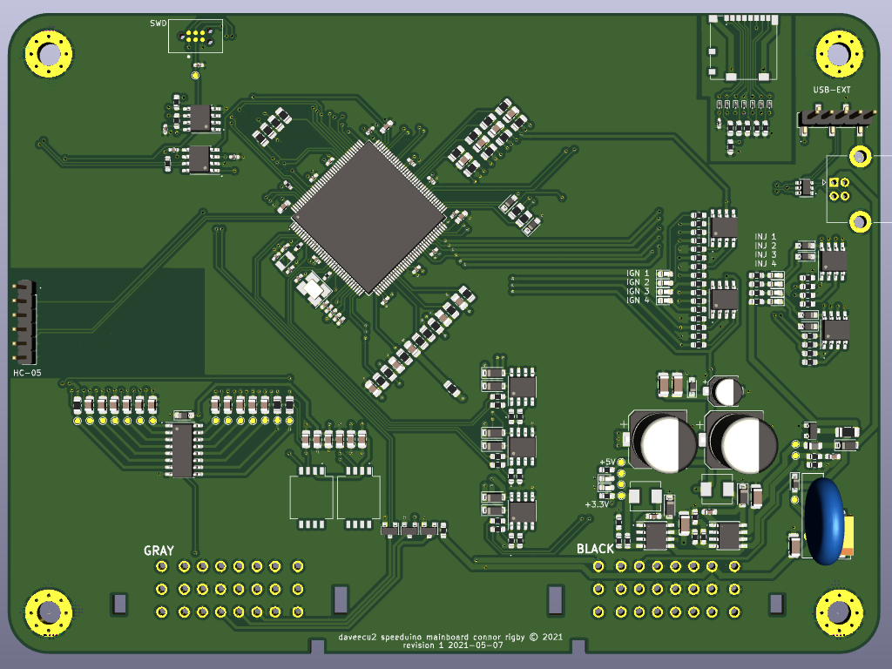

# DaveECU2 Speeduino Mainboard

## Features

* 4 Injectors
* 4 Ignitions
* 1 each CAM and Crank input
* 1 wire Idle
* PWM boost
* AC control
* 4 additional high current outputs
* SD card for logginglogging
* [PLANNED] RTC w/ battery backup

## Schematic TODO

* Calculate R53 and R54 values for 3v3 rail
* ~~Convert all resistors in the sensor sheet to 0402~~ have to hand solder so don't want that small
* ~~Convert all capacitors in the sensor sheet to 0402~~ have to hand solder so don't want that small
* Condense common resistors into common values
* Condense common caps into common values
* ~~Find a USB-C connector~~ Replaced with USB Type B "printer" connector
* Check if Q1 and Q2 can be the same part
